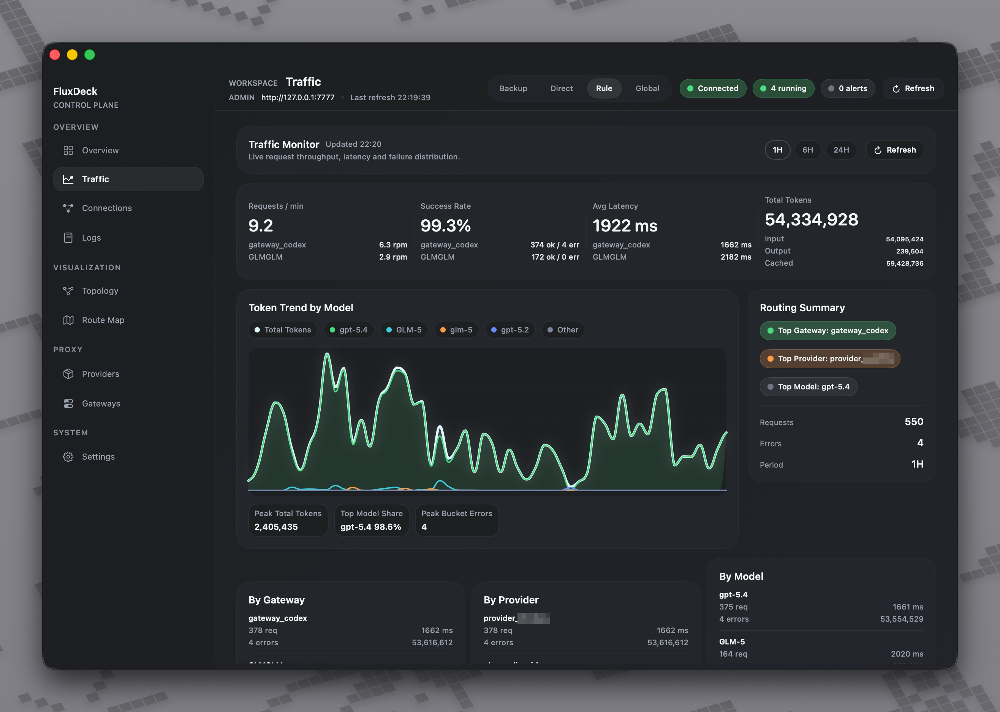

# FluxDeck

FluxDeck 是一个本地优先的 macOS LLM Gateway 工作台，用来管理 Provider、编排 Gateway、转发 OpenAI / Anthropic 兼容请求，并观察本机流量、日志与路由状态。

它由三部分组成：

- `fluxd`：本地服务，负责 Admin API、Gateway 运行时、协议转发与健康管理
- `fluxctl`：命令行管理工具，用于脚本化创建与维护 Provider / Gateway
- 原生桌面端：当前主线操作界面，用于配置、诊断与可视化本地 LLM 路由工作区



当前截图展示的是原生桌面端 `Traffic` 工作台：已经支持按模型的 token 趋势图、路由摘要，以及按 Gateway / Provider 的流量观察。

## 当前状态

FluxDeck 当前阶段的主线是 `apps/desktop-macos-native` 原生桌面端，目标是交付一个可观测、可维护、可本地运行的 macOS LLM Gateway 工作台。

- 原生桌面端已覆盖 Provider、Gateway、Logs、Traffic、Topology 等主流程
- `fluxd` 与 `fluxctl` 可作为稳定基础设施使用
- 多 Provider 有序链路、Gateway 级健康状态与请求级故障切流已经落地
- Web 技术栈桌面端 `apps/desktop` 已暂停新增功能开发，当前不应作为主使用入口

## 当前能力

你现在可以用 FluxDeck：

- 管理多个上游 Provider
  - 支持 `openai`、`openai-response`、`anthropic` 等 provider kind
- 创建本地 Gateway
  - 支持 OpenAI 与 Anthropic 入站
  - 支持 OpenAI / Anthropic 上游转发
  - 支持重复配置 `route_targets` 形成有序主备链路
- 在请求级别自动切流
  - 当上游出现网络错误、`429` 或 `5xx` 时，会顺序切到下一个可用 Provider
  - 健康状态会按 Gateway 作用域回写，并暴露 `active_provider_id`、`health_summary`
- 为本地客户端提供稳定入口
  - 可为 Claude Code、兼容 OpenAI 的工具或自定义脚本提供固定本地端点
- 观察日志与流量
  - `Logs` 支持紧凑日志行扫描模型映射、错误摘要与 token 明细
  - `Traffic` 主图区支持按模型堆叠的 token 趋势、图例与 hover tooltip
  - `Topology` 页面支持三列 Sankey 主舞台，可查看 `Entrypoints -> Gateways -> Providers` 的 token 流向与热点链路
- 安全应用运行时配置
  - 运行中的 Gateway 在保存后若配置确实变化，`fluxd` 会自动执行 `stop -> start`

## 适用场景

FluxDeck 适合这些本地工作流：

- 在一台机器上统一管理多个 LLM 上游与路由入口
- 为本地工具提供固定的 OpenAI / Anthropic 兼容地址
- 验证模型映射、协议兼容与主备切流是否按预期工作
- 排查 Claude Code 或其他客户端经过本地网关后的请求行为
- 观察最近流量、错误、token 分布与拓扑热点路径

## 快速开始

### 1. 启动 `fluxd`

```bash
FLUXDECK_DB_PATH="$HOME/.fluxdeck/fluxdeck.db" \
FLUXDECK_ADMIN_ADDR="127.0.0.1:7777" \
cargo run -p fluxd
```

默认情况下，FluxDeck 使用本地 SQLite 数据库：

- 默认路径：`~/.fluxdeck/fluxdeck.db`
- 也可通过 `FLUXDECK_DB_PATH` 覆盖

### 2. 使用 `fluxctl` 创建 Provider

```bash
cargo run -p fluxctl -- --admin-url http://127.0.0.1:7777 provider create \
  --id provider_main \
  --name "Main Provider" \
  --kind openai \
  --base-url https://api.openai.com/v1 \
  --api-key sk-xxx \
  --models gpt-4o-mini,gpt-4.1
```

### 3. 创建 Gateway

```bash
cargo run -p fluxctl -- --admin-url http://127.0.0.1:7777 gateway create \
  --id gateway_main \
  --name "Gateway Main" \
  --listen-host 127.0.0.1 \
  --listen-port 18080 \
  --inbound-protocol openai \
  --upstream-protocol provider_default \
  --default-provider-id provider_main \
  --route-target provider_main:0:true \
  --default-model gpt-4o-mini \
  --enabled true \
  --auto-start true
```

补充说明：

- `inbound_protocol` 与 `upstream_protocol` 的协议值集合已与 Provider `kind` 对齐
- `upstream_protocol=provider_default` 表示运行时跟随默认 Provider `kind`
- OpenAI 系 Gateway 当前已兼容：
  - `/v1/chat/completions`
  - `/responses`
  - `/v1/responses`
- 如果要配置主备链路，可在 `gateway create` 或 `gateway update` 中重复传入 `--route-target provider_id:priority[:enabled]`

### 4. 打开原生桌面端

原生桌面端是当前主线体验，也是第一优先级支持对象：

- 工程路径：`apps/desktop-macos-native`
- 当前已覆盖 Provider、Gateway、Logs、Traffic、Topology 主流程
- Web 端界面 `apps/desktop` 已暂停开发，当前不可用

更完整的本地运行方式请参考 [本地运行手册](./docs/ops/local-runbook.md)。

## Gateway 更新行为

FluxDeck 会自动处理运行中实例的配置应用问题：

- 如果 Gateway 当前处于 `running`
- 并且你保存后的配置与原配置确实不同
- `fluxd` 会自动执行一次 `stop -> start`

如果 Gateway 当前未运行，则只保存配置，不会自动启动。

## 文档入口

如果你想继续深入，优先看这些文档：

- [使用说明](./docs/USAGE.md)
- [本地运行手册](./docs/ops/local-runbook.md)
- [产品当前状态](./docs/product/current-state.md)
- [架构说明](./ARCHITECTURE.md)
- [Admin API 契约](./docs/contracts/admin-api-v1.md)
- [质量门禁](./docs/testing/quality-gates.md)
- [Anthropic 兼容 E2E 说明](./docs/testing/anthropic-compat-e2e.md)
- [文档总览](./docs/README.md)

## 提交前验证

当前质量门禁分为三层：

- `dev-gate`：本地默认自检，执行 `cargo test -q` 与 `./scripts/e2e/smoke.sh`
- `ci-gate`：在 `dev-gate` 基础上强制加入原生端 `xcodebuild test`
- `release-gate`：在 `ci-gate` 基础上增加原生端构建验证

完整定义见 [docs/testing/quality-gates.md](./docs/testing/quality-gates.md)。

如果遇到工具链切换后 `cargo test` 出现 `E0463 can't find crate`，先执行：

```bash
cargo clean
```
